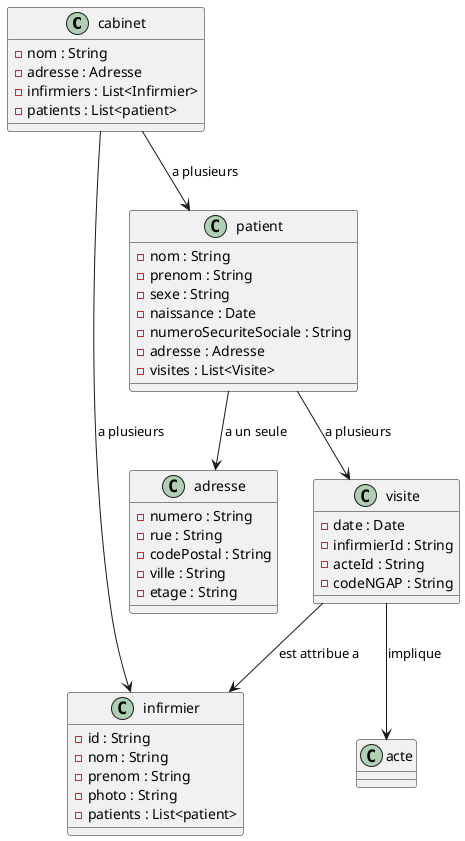

# MODELISATION DU PROJET CABINET INFIRMIER  UML
### PlantUML

```plantuml
@startuml
class cabinet {
  -nom : String
  -adresse : Adresse
  -infirmiers : List<Infirmier>
  -patients : List<patient>
}

class infirmier {
  -id : String
  -nom : String
  -prenom : String
  -photo : String
  -patients : List<patient>
}

class patient {
  -nom : String
  -prenom : String
  -sexe : String
  -naissance : Date
  -numeroSecuriteSociale : String
  -adresse : Adresse
  -visites : List<Visite>
}

class adresse {
  -numero : String
  -rue : String
  -codePostal : String
  -ville : String
  -etage : String
}

class visite {
  -date : Date
  -infirmierId : String
  -acteId : String
  -codeNGAP : String
}

cabinet --> infirmier : "a plusieurs"
cabinet --> patient : "a plusieurs"
patient --> adresse : "a un seule"
patient --> visite : "a plusieurs"
visite --> infirmier : "est attribue a "
visite --> acte : "implique"

@enduml


```
### SUITE